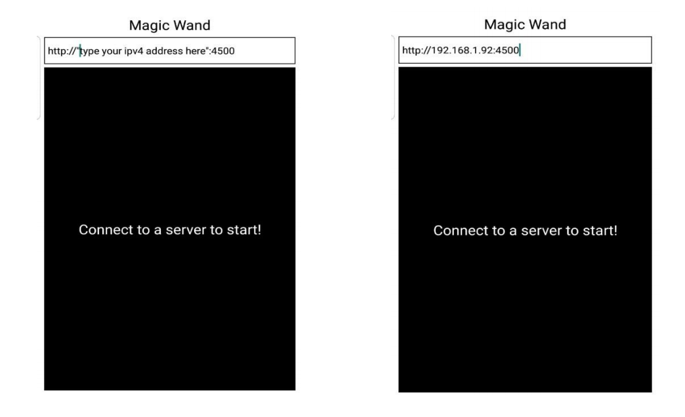

# Magic Wand App
An App that sends out the accelerometer &amp; gyroscope values to any REST server endpoint.

# Demo
[Demo Video](https://youtu.be/U9QK4XHbvvk)

<div align="center"> </div>
<div align="center"> </div>
     
# Example Request
Example POST request sent from the phone and received by the server.
```
{ accelerometer: 
   { x: [ 0.31005859375, 2.185302734375, 1.886474609375, 1.5223388671875 ],
     y: [ 0.370849609375, 0.820068359375, 0.4541015625, 0.3193359375 ],
     z: [ 0.807861328125, 0.4842529296875, 0.7607421875, 0.9888916015625 ] },
  gyroscope: 
   { x: [ -0.6569733619689941, -1.8915319442749023, -1.700331211090088 ],
     y: [ -1.2060374021530151, -0.3862561881542206, -0.7735447287559509 ],
     z: [ -1.9749579429626465, -3.614520311355591, -4.208281517028809 ] } }
```


# Tech Stack
Made with React Native and Expo - so can be ported to both android and iOS!


